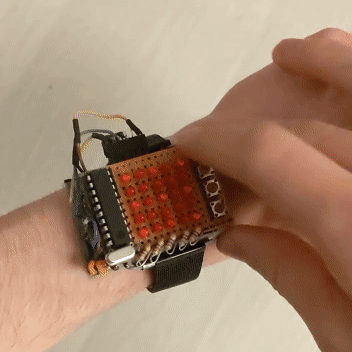

# led-watch

Schematic: hardware.txt

*Show current time:*

Features:

- *Roll a die*
- *Scrolling Text*
- *Sync Time and alarms with computer over serial*

## Challenges

Optimizing the code to fit in just 2048 bytes ...

## Notes

Nine of the LEDs I used were a lot brighter than the rest, so I am dimming them at 10% in software.

