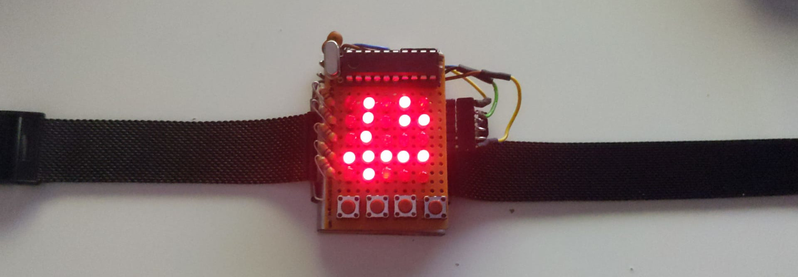

# led-watch

Schematic: hardware.txt

*UART Mode (Sync Time / Alarms with computer over serial):*

*Show current time: (Yeah, I know I need to fix my sleep schedule xD)*

## Challenges

Getting the code to fit in just 2048 bytes ...
Currently code size stands at 2028.

## Notes

Nine of the LEDs I used were a lot brighter than the rest, so I am dimming them at 10% in software.

